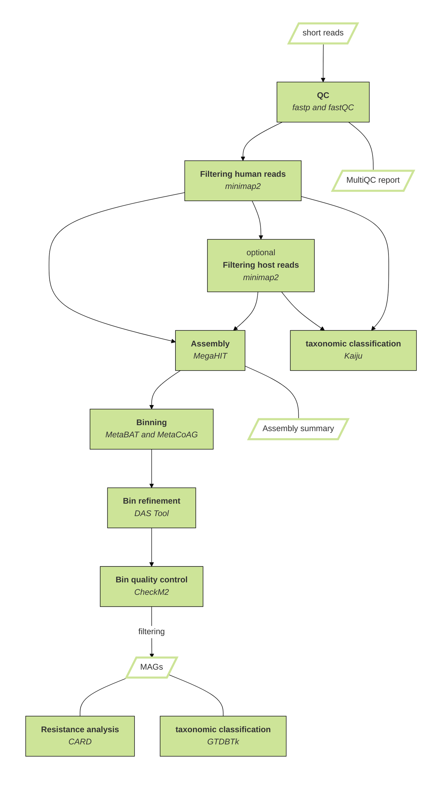

# ResMAG - name pending

[](https://snakemake.github.io)
[](https://github.com/<owner>/<repo>/actions?query=branch%3Amain+workflow%3ATests)


ResMAG is a state-of-the-art and user-friendly Snakemake workflow designed for the analysis of metagenomic data. It integrates multiple bioinformatics tools and algorithms to facilitate key steps in metagenome analysis, including bin refinement, metagenome-assembled genome (MAG) reconstruction, taxonomic classification of MAGs, and identification of antibiotic resistance genes.<br />

### Key Features

**Binning Techniques**: Employ a collection of five state-of-the-art binning tools to partition metagenomic contigs into individual bins, allowing for comprehensive and accurate analysis.<br />

**MAG Reconstruction**: Utilize cutting-edge algorithms to reconstruct high-quality metagenome-assembled genomes (MAGs) from sequencing data.<br />

**Taxonomic Classification**: Apply advanced taxonomic classification methods to assign taxonomic labels to MAGs and identify the microbial community composition within the metagenomic samples.<br />

**Antibiotic Resistance Gene Identification**: Perform in-depth analysis to detect and characterize antibiotic resistance genes within the metagenomic data, providing valuable insights into antimicrobial resistance profiles.<br />

**Performance Refinement**: Continuously optimize the pipeline by incorporating the latest advancements in metagenomics research, ensuring the highest accuracy and efficiency in metagenomic data analysis.<br />

### Overview


## Usage

### Preparations

#### Clone workflow
To prepare the workflow clone it to your desired working folder via git or your preferred IDE
```
git clone https://github.com/IKIM-Essen/metagenomics_res.git
```

#### Download GTDB
The GTDB needs to be downloaded and decompressed, it requires about 110 Gb.
1. Change to the cloned workflow directory
2. Create a new folder `resources/gtdb/` and change to this directory
3. Download the latest version of GTDB
   **or**
   if you have already downloaded a version of GTDB move the `gtdbtk_data.tar.gz` file to `resources/gtdb/`
4. Unarchive the downloaded file
5. After successful step 4: the archive can be removed

```
wget https://data.ace.uq.edu.au/public/gtdb/data/releases/latest/auxillary_files/gtdbtk_package/full_package/gtdbtk_data.tar.gz
tar xvzf gtdbtk_data.tar.gz
```

#### Install Snakemake
Create a snakemake environment using [mamba](https://mamba.readthedocs.io/en/latest/) via:

 ```mamba create -c conda-forge -c bioconda -n snakemake snakemake=7.32.3```

For installation details, see the [instructions in the Snakemake documentation](https://snakemake.readthedocs.io/en/stable/getting_started/installation.html).

#### Configuring workflow
1. Edit the `config/config.yaml` file:
   - Specify a project name (`project-name`)
   - Specify filtering options for human reads (`human-filtering`)
   - Specify host filtering options, if you have a non-human host (`host-filtering`)
   - Specify options for GTDB database (see [Download GTDB](#Download-GTDB))
2. Provide sample information in the `config/pep/samples.csv` file while keeping the header and the format:

```
sample_name,fq1,fq2
sample1,path/to/your/fastq/sample1_R1.fastq.gz,path/to/your/fastq/sample1_R2.fastq.gz
```


### Run the workflow
Activate the conda environment:
```conda activate snakemake```

Test your configuration by performing a dry-run via
```snakemake --use-conda -n```

Executing the workflow:
```snakemake --use-conda --cores $N --rerun-incomplete```

using `$N` cores. It is recommended to use all available cores.

The usage of this workflow is described in the [Snakemake Workflow Catalog](https://snakemake.github.io/snakemake-workflow-catalog/?usage=<owner>%2F<repo>).

## Output

## Tools

A list of tools used in the pipeline:

| Tool      | Link                                              |
| --------- | ------------------------------------------------- |
| CheckM2   | https://doi.org/10.1038/s41592-023-01940-w        |
| CoverM    | https://github.com/wwood/CoverM                   |
| DAS Tool  | https://doi.org/10.1038/s41564-018-0171-1         |
| fastp     | https://doi.org/10.1093/bioinformatics/bty560     |
| FastQC    | www.bioinformatics.babraham.ac.uk/projects/fastqc |
| Kaiju     | https://doi.org/10.1038/ncomms11257               |
| MEGAHIT   | https://doi.org/10.1093/bioinformatics/btv033     |
| MetaBAT   | http://dx.doi.org/10.7717/peerj.1165              |
| MetaCoAG  | https://doi.org/10.1101/2021.09.10.459728         |
| minimap2  | https://doi.org/10.1093/bioinformatics/bty191     |
| MultiQC   | www.doi.org/10.1093/bioinformatics/btw354         |
| pandas    | pandas.pydata.org                                 |
| samtools  | https://doi.org/10.1093/gigascience/giab008       |
| Snakemake | www.doi.org/10.12688/f1000research.29032.1        |

## Contact Information

For any questions, or feedback, please contact the project maintainer at josefa.welling@uk-essen.de. We appreciate your input and support in using and improving ResMAG.

## Acknowledgements

We would like to express our gratitude towards Katharina Block, Adrian Doerr, Miriam Balzer, Alexander Thomas, Johannes Köster, Ann-Kathrin Doerr and the IKIM who have contributed to the development and testing of ResMAG. Their valuable insights and feedback have been helpful throughout the creation of the workflow.

## Citation

A paper is on its way. If you use ResMAG in your work before the paper, then please consider citing this GitHub.

## License

ResMAG is released under the [BSD-2 Clause](https://www.open-xchange.com/hubfs/2_Clause_BSD_License.pdf?hsLang=en). Please review the license file for more details.